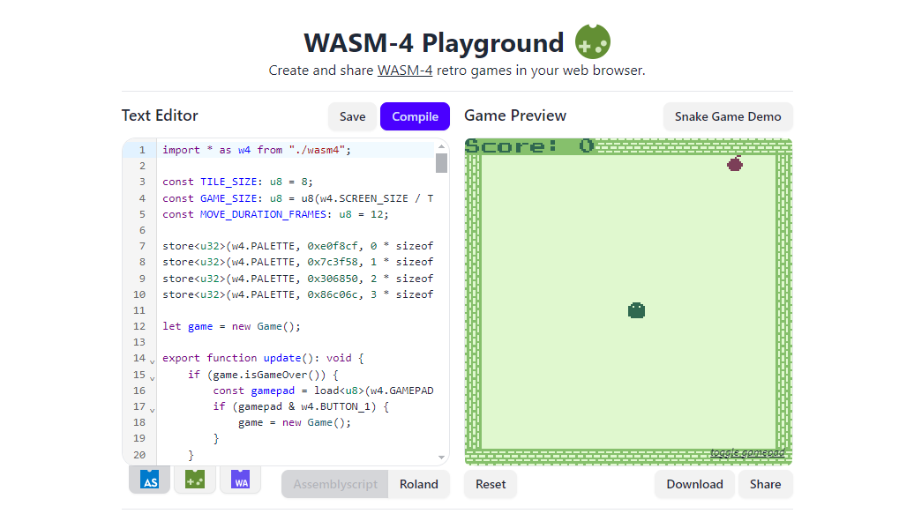

# wasm4-playground

Write retro video games in AssemblyScript.
[Visit](https://grantshandy.github.io/wasm4-playground)!



<hr/>

Note that this repository contains submodules, so in order to clone and build you must use:
```
 $ git clone --recurse-submodules https://github.com/grantshandy/wasm4-playground
 $ cd wasm4-playground/ && make
```
